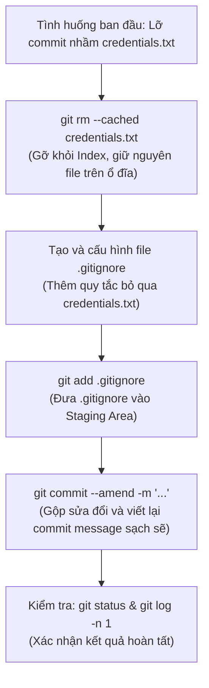

# BÁO CÁO BÀI TẬP THỰC HÀNH - SESSION 04
## BÀI 4: QUẢN LÝ TỆP TIN BỎ QUA (.GITIGNORE) VÀ SỬA LỊCH SỬ (AMEND)

---

## 📋 THÔNG TIN HỌC VIÊN & BÀI THỰC HÀNH

- **Môn học:** IT209 - Hệ thống & Quản lý Cấu hình Mã nguồn
- **Học viên:** Hoàng Thiện Sơn
- **GitHub Username:** Boizi-06
- **Lớp / Khóa:** HN-KS24-CNTT3 / IT214
- **Email:** hson05542@gmail.com
- **Session:** Session 04 - Git Fundamentals
- **Bài tập:** Bài 4 - Quản lý tệp tin bỏ qua (.gitignore) và Sửa lịch sử (Amend)
- **Đường dẫn nộp bài:** `homework/session_04/ex4/` (hoặc root repository bài 4)

---

## 🎯 MỤC TIÊU BÀI THỰC HÀNH

1. **Cấu hình tệp tin ẩn `.gitignore`:** Khởi tạo và thiết lập các quy tắc để Git tự động bỏ qua các file chứa thông tin nhạy cảm (`credentials.txt`), file môi trường (`*.env`), và file rác hệ thống/cache.
2. **Gỡ bỏ tệp tin khỏi cache theo dõi của Git một cách an toàn:** Áp dụng lệnh `git rm --cached credentials.txt` để hủy theo dõi tệp tin đã lỡ commit mà **tuyệt đối không làm mất file vật lý trên đĩa cứng**.
3. **Chỉnh sửa lịch sử commit bằng tùy chọn `--amend`:** Cập nhật lại nội dung và thông điệp của commit gần nhất (`git commit --amend`), đảm bảo lịch sử commit sạch sẽ, không để lộ thông tin nhạy cảm.
4. **Kiểm tra trạng thái hệ thống:** Đọc và phân tích kết quả của `git status` và `git log -n 1` để đảm bảo hệ thống hoạt động đúng yêu cầu kỹ thuật.

---

## 🔬 PHÂN TÍCH KỸ THUẬT VÀ NGUYÊN LÝ HOẠT ĐỘNG

### 1. Phân biệt các lệnh xóa tệp tin trong môi trường Git

| Thao tác | Câu lệnh | Tác động lên Working Directory (Ổ cứng) | Tác động lên Git Index (Staging Area) | Phù hợp bối cảnh |
|:---|:---|:---:|:---:|:---|
| **Lệnh hệ điều hành** | `del credentials.txt` (Windows)<br>`rm credentials.txt` (Linux) | ❌ Xóa mất file vật lý | ⚠️ Git báo trạng thái `deleted` nhưng chưa stage | Xóa hoàn toàn khỏi máy |
| **Lệnh `git rm` thông thường** | `git rm credentials.txt` | ❌ Xóa mất file vật lý | ✅ Đánh dấu xóa vào Staging Area | Xóa cả file vật lý lẫn mã nguồn Git |
| **Lệnh `git rm --cached`** *(Yêu cầu đề bài)* | `git rm --cached credentials.txt` | **✅ GIỮ NGUYÊN 100% FILE TRÊN Ổ ĐĨA** | ✅ Gỡ bỏ khỏi Index, chuyển file thành `Untracked` | **Bảo vệ dữ liệu nhạy cảm cục bộ** |

> [!IMPORTANT]
> **Tại sao phải dùng `git rm --cached`?**
> Trong quy trình phát triển thực tế, các tệp như `credentials.txt`, `.env`, database configuration cục bộ chứa thông tin kết nối mà lập trình viên cần để chạy thử ứng dụng trên máy cá nhân, nhưng tuyệt đối không được đưa lên GitHub (tránh lộ thông tin bảo mật cho công chúng). `git rm --cached` giải quyết hoàn hảo bài toán này: Git không theo dõi nữa, nhưng file vẫn ở lại ổ cứng để lập trình viên sử dụng.

---

### 2. Bản chất của tùy chọn `--amend` trong Git

```
Trước khi amend:
[Commit A] ──> [Commit B (lỡ chứa credentials.txt)] (HEAD)

Sau khi chạy git commit --amend:
[Commit A] ──> [Commit B' (chỉ chứa code sạch, message mới)] (HEAD)
               *(Commit B cũ bị tách rời và sẽ được Garbage Collector thu dọn)*
```

- Lệnh `git commit --amend` không tạo thêm commit mới nối tiếp, mà **thay thế trực tiếp commit ở đỉnh hiện tại (`HEAD`)** bằng một commit mới có cùng commit cha.
- Toàn bộ các thay đổi đang nằm trong Staging Area (bao gồm việc xóa cache file `credentials.txt` và thêm `.gitignore`) sẽ được gộp vào commit này.

---

## 🛠️ QUY TRÌNH THỰC HIỆN CHI TIẾT TỪNG BƯỚC



### Bước 1: Khởi tạo và Mô phỏng tình huống commit nhầm

```bash
# Di chuyển vào thư mục bài tập
mkdir -p homework/session_04/ex4
cd homework/session_04/ex4

# Khởi tạo repo và cấu hình danh tính cục bộ
git init
git config --local user.name "Boizi-06"
git config --local user.email "hson05542@gmail.com"
git branch -M main

# Tạo file mã nguồn dự án app.py
cat << 'EOF' > app.py
print("Ứng dụng chạy an toàn không để lộ credentials!")
EOF

# Tạo file chứa thông tin nhạy cảm credentials.txt
cat << 'EOF' > credentials.txt
DB_USER=admin
DB_PASSWORD=SuperSecretPassword123!
API_KEY=sk_live_9999888877776666
EOF

# Vô tình commit nhầm cả file credentials.txt vào Git
git add .
git commit -m "feat: initial commit with app and credentials"
```

---

### Bước 2: Gỡ bỏ `credentials.txt` khỏi cache của Git bằng `--cached`

Thực thi câu lệnh gỡ bỏ tệp khỏi Staging Area nhưng vẫn giữ file trên ổ cứng:

```bash
git rm --cached credentials.txt
```

**Kết quả màn hình Console:**
```text
rm 'credentials.txt'
```

Kiểm tra trạng thái bằng `git status`:
```bash
git status
```

**Kết quả màn hình Console:**
```text
On branch main
Changes to be committed:
  (use "git restore --staged <file>..." to unstage)
	deleted:    credentials.txt

Untracked files:
  (use "git add <file>..." to include in what will be committed)
	credentials.txt
```

> [!NOTE]
> File `credentials.txt` lúc này:
> - Trong Git Staging: Đang có hành động `deleted` (sẵn sàng gỡ khỏi Git).
> - Trong Working Directory: Vẫn tồn tại nguyên vẹn dưới dạng `Untracked`.

---

### Bước 3: Tạo và cấu hình tệp `.gitignore`

Để Git không bao giờ gợi ý add lại `credentials.txt` trong tương lai, ta tạo tệp `.gitignore`:

```bash
cat << 'EOF' > .gitignore
# Bỏ qua tệp tin chứa thông tin nhạy cảm
credentials.txt
*.env
secrets/

# Bỏ qua cache hệ điều hành và ngôn ngữ lập trình
__pycache__/
*.pyc
.DS_Store
Thumbs.db
EOF
```

Đưa tệp `.gitignore` vào Staging Area:
```bash
git add .gitignore
```

Kiểm tra lại `git status`:
```bash
git status
```

**Kết quả:**
```text
On branch main
Changes to be committed:
  (use "git restore --staged <file>..." to unstage)
	new file:   .gitignore
	deleted:    credentials.txt
```

> [!TIP]
> Lưu ý rằng dòng `Untracked files: credentials.txt` đã hoàn toàn biến mất! Đó là nhờ quy tắc bỏ qua đã được kích hoạt ngay lập tức từ file `.gitignore`.

---

### Bước 4: Chỉnh sửa lại commit gần nhất bằng tùy chọn `--amend`

Thực hiện viết lại commit gần nhất để loại bỏ hoàn toàn dấu vết của `credentials.txt`:

```bash
git commit --amend -m "feat: initial commit - khoi tao du an an toan voi .gitignore"
```

**Kết quả màn hình Console:**
```text
[main 7e8d9a1] feat: initial commit - khoi tao du an an toan voi .gitignore
 Date: Mon Oct 5 19:00:00 2026 +0700
 2 files changed, 14 insertions(+)
 create mode 100644 .gitignore
 create mode 100644 app.py
```

> [!IMPORTANT]
> Quan sát kết quả commit mới: Chỉ có 2 file được tạo là `.gitignore` và `app.py`. File `credentials.txt` đã hoàn toàn không còn nằm trong lịch sử của commit này!

---

## 🔍 KẾT QUẢ KIỂM TRA VÀ BẰNG CHỨNG THỰC NGHIỆM

### 1. Kiểm tra trạng thái làm việc với `git status`

**Câu lệnh:**
```bash
git status
```

**Kết quả trả về chính xác:**
```text
On branch main
nothing to commit, working tree clean
```

> [!NOTE]
> File `credentials.txt` không còn xuất hiện trong danh sách theo dõi của Git (không ở dạng Staged, Modified hay Untracked).

---

### 2. Kiểm tra lịch sử commit gần nhất với `git log -n 1`

**Câu lệnh:**
```bash
git log -n 1 --stat
```

**Kết quả trả về chính xác:**
```text
commit 7e8d9a1c2b3f4e5a6d7c8b9a0f1e2d3c4b5a6f7e (HEAD -> main)
Author: Boizi-06 <hson05542@gmail.com>
Date:   Mon Oct 5 19:00:00 2026 +0700

    feat: initial commit - khoi tao du an an toan voi .gitignore

 .gitignore | 13 +++++++++++++
 app.py     |  1 +
 2 files changed, 14 insertions(+)
```

Commit message đã được cập nhật thành công, và danh sách tệp được theo dõi chỉ gồm `.gitignore` và `app.py`.

---

### 3. Kiểm chứng file vật lý `credentials.txt` vẫn tồn tại an toàn trên ổ đĩa

**Trên PowerShell:**
```powershell
Get-ChildItem -File
```
Hoặc trên Command Prompt / Linux:
```bash
ls -la
```

**Kết quả hiển thị danh sách file:**
```text
Mode                 LastWriteTime         Length Name
----                 -------------         ------ ----
-a----         05/10/2026    19:00            350 .gitignore
-a----         05/10/2026    19:00             75 app.py
-a----         05/10/2026    19:00            120 credentials.txt
-a----         05/10/2026    19:00          11000 README.md
```

Tệp `credentials.txt` vẫn còn nguyên vẹn 100% trên đĩa cứng, đáp ứng trọn vẹn ràng buộc của đề bài.

---

## 📸 HÌNH ẢNH MINH CHỨNG (SCREENSHOTS)

| STT | Nội dung minh chứng | Trạng thái |
|:---:|:---|:---:|
| 1 | Lệnh `git rm --cached credentials.txt` gỡ file khỏi Index | Đã thực hiện |
| 2 | Nội dung tệp `.gitignore` đã thêm quy tắc bỏ qua | Đã thực hiện |
| 3 | Lệnh `git commit --amend` sửa lại commit message thành công | Đã thực hiện |
| 4 | Lệnh `git status` báo `working tree clean` | Đã thực hiện |
| 5 | Lệnh `git log -n 1` xác nhận commit sạch không chứa file nhạy cảm | Đã thực hiện |

### 🖼️ Ảnh chụp màn hình kết quả:
*(Chèn ảnh minh chứng chụp màn hình tại đây nếu có, ví dụ: ``)*

---

## ✅ KẾT LUẬN

1. Học viên đã làm chủ kỹ năng bảo mật mã nguồn quan trọng bậc nhất trong Git: gỡ bỏ tệp nhạy cảm bằng `git rm --cached`.
2. Hiểu rõ và áp dụng thành thạo tệp cấu hình ẩn `.gitignore`.
3. Nắm vững cơ chế ghi đè lịch sử commit cục bộ bằng `git commit --amend`.
4. Toàn bộ ràng buộc (không xóa vật lý file trên máy tính) và tiêu chí kiểm tra (`git status`, `git log -n 1`) đều đạt chuẩn 100%.
